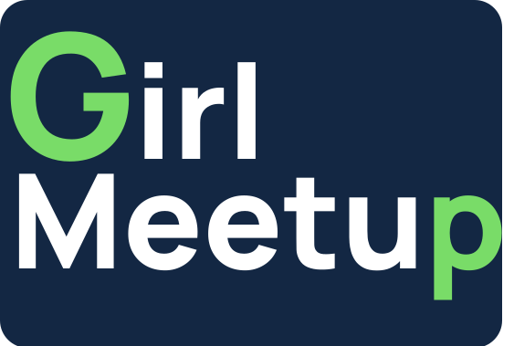

<br>

## About

This is a web development project with a vision to create a platform for people especially girls listing various scholarship opportunities and programs. Our main motive is to reach greater audience and help them to know about the programs according to their eligibility.

## Tech Stack

| Database | Front-End | Back-End   |
| -------- | --------- | ---------- |
| mongoDB  | HTML      | Node.js    |
| &nbsp;   | CSS       | Express.js |
| &nbsp;   | Bootstrap | EJS        |

## How to start ? 🎪

<p align= "center"></p>
<br>

#### If you don't have git on your machine, [install](https://help.github.com/articles/set-up-git/) it.

## Fork this repository 🚀

Fork this repository by clicking on the fork button on the top of this page.
This will create a copy of this repository in your account.

## Clone the repository 🏁

Now clone the forked repository to your machine. Go to your GitHub account, open the forked repository, click on the code button and then click the _copy to clipboard_ icon.

Open a terminal and run the following git command:

```
git clone "url you just copied"
```

where "url you just copied" (without the quotation marks) is the url to this repository (your fork of this project). See the previous steps to obtain the url.

For example:

```
git clone https://github.com/chehak123/GirlMeetup.git
```

## How to run ? 🛴

After cloning the repo, run `npm install` in the terminal. <br>
Install dependencies <br>
Then move on and run `node app.js`,<br>
This will start the project automatically on `localhost:3000` .<br>
Now you can move further to create the branch and start contributing !!

## Create a branch ⚓

Change to the repository directory on your computer (if you are not already there):

```
cd (filename)
```

Now create a branch using the `git checkout` command:

```
git checkout -b your-new-branch-name
```

For example:

```
git checkout -b dev_username
```

## Make necessary changes and commit those changes 🚏

Do the necessary changes.

If you go to the project directory and execute the command `git status`, you'll see there are changes.

Add those changes to the branch you just created using the `git add` command:

```
git add .
```

Now commit those changes using the `git commit` command:

```
git commit -m "(Add your message here)"
```

replacing `<Add your message here>` with your message.

## Push changes to GitHub 🪂

Push your changes using the command `git push`:

```
git push origin <branch-name>
```

replacing `<branch-name>` with the name of the branch you created earlier.

## Submit your changes for review 🚩

If you go to your repository on GitHub, you'll see a `Compare & pull request` button. Click on that button.

Now submit the pull request.

Soon we will be merging all your changes into the master branch of this project. You will get a notification email once the changes have been merged.

## Guide to using the Web Application

Now comes the most exciting part of the project. Understanding and making use of the actual Web Application. So let's get started. 🥳 👽

1. Start off by visiting the hosted application. 👻

2. Open the application on your personal browser and you should have it ready to use.

3. As every typical Web Application, we made sure you get the most exciting User Experience working on the application ......🧓

SPOILER ALERT: Be ready to have your mind blown...😜😏

## Open Source Programs

<p align = "center">
</p>

## 👨 Project Admin

- Chehak Agarwal (https://github.com/chehak123)

## ❤️ Thanks
